# extension3DSlicer

[](https://doi.org/10.5281/zenodo.13871319)

This extension of 3D Slicer was created as part of my M2 internship in Computer Science for Image and Sound at LaBRI and I2M from april 2024 to september 2024.

## Name
Visualization and analysis of the structure of a natural material

## Developer
RIVERAIN Olivier

## Description
Master 2 Internship in Computer Science for Image and Sound supervised by Fabien Baldacci (LaBRI), Louise Le Barbenchon (I2M) and Anne Vialard (LaBRI).

## Installing 3D Slicer

https://slicer.readthedocs.io/en/latest/user_guide/getting_started.html#installing-3d-slicer

### Installing under linux

```sh
sudo apt install libglu1-mesa libpulse-mainloop-glib0 libnss3
```

download and open the tar.gz archive and copy directory to the location of your choice

run the Slicer executable


### Installing under macOS

```sh
brew install --cask slicer
```

### Installing under windows

download and run the installer

run slicer from the Windows start menu

## Installing dependances for the extension

### Installing under linux

```sh
sudo apt install cmake libinsighttoolkit5-dev libmagick++-6.q16-dev python3-numpy python3-matplotlib
```

### Installing under macOS

```sh
brew install cmake
brew install itk
brew install imagemagick
pip3 install numpy matplotlib
```

### Installing under windows

installing python and pip from https://www.python.org/downloads/windows/

```sh
pip install numpy matplotlib
```

<!--
installing mingw-w64 from https://www.mingw-w64.org/ for example winlibs 14.2.0 release 2 without t LLVM/Clang/LLD/LLDB

extract in C:\ it creates the directory mingw64

add  C:\mingw64\bin to the path in the environment variables


open powershell and type g++ --version and you can see

 

installing itk from https://docs.itk.org/en/latest/download.html 

extract in C:\ it creates the directory InsightToolkit-5.3.0

-->


installing visual studio community from https://visualstudio.microsoft.com/fr/downloads/ with Desktop development C++ workload, https://learn.microsoft.com/fr-fr/cpp/build/vscpp-step-0-installation?view=msvc-170

compiling itk

```sh
cd InsightToolkit-5.3.0
mkdir build
cd build
cmake -G "MinGW Makefiles" ..
mingw32-make
```

## Compile programs in C++

### Under Linux and macOS

```sh
cd programs

mkdir build

cd build

cmake ..

make

cp ../displayProfile.py .

cp ../applyMask.py .

```

### Under Windows
todo

## Installing extension in 3D Slicer


[Tutorial to install an extension in 3D Slicer] (https://www.youtube.com/watch?v=QsxzjQb05D4)

## Tutorials

### Bind C++ programs with the extension

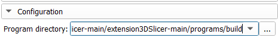

click on the three small dots and select the folder containing the C++ executable files


### Create a 3D file

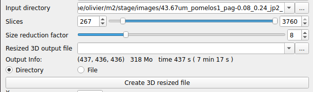

### Display a 3D file

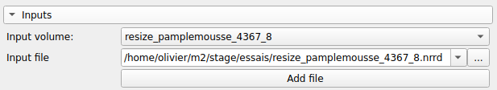


### Create an area of interest

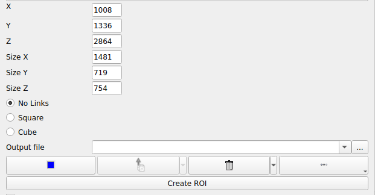

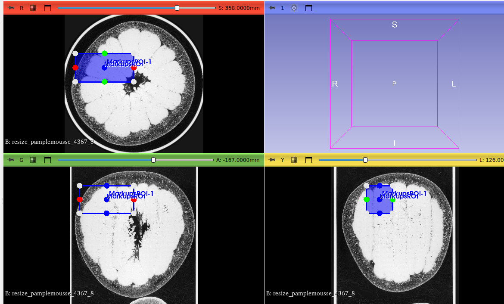

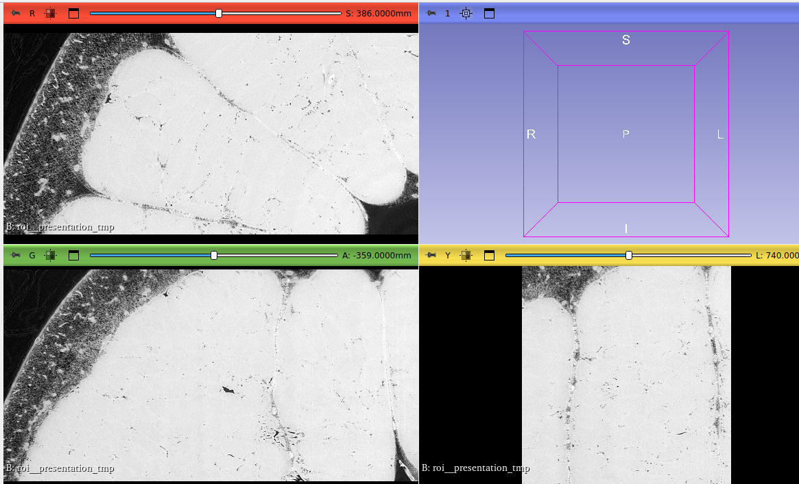


### Navigate through the different acquisition resolutions

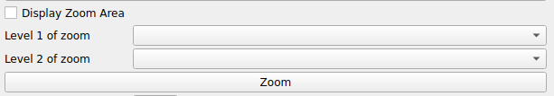

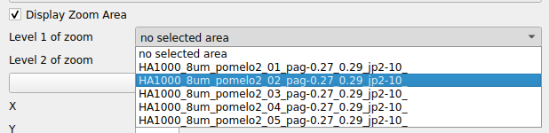

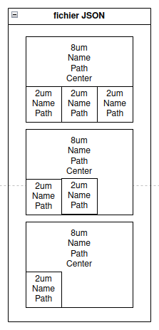

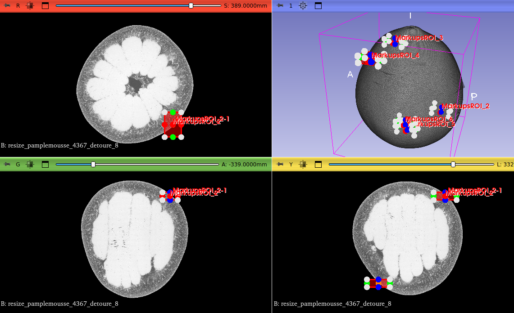

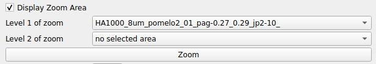


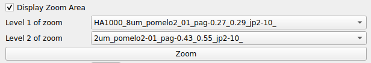

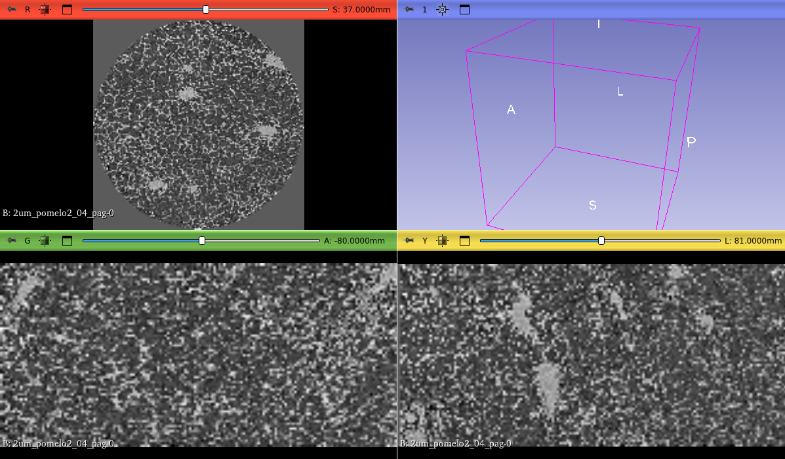

### Compute and display a density profile

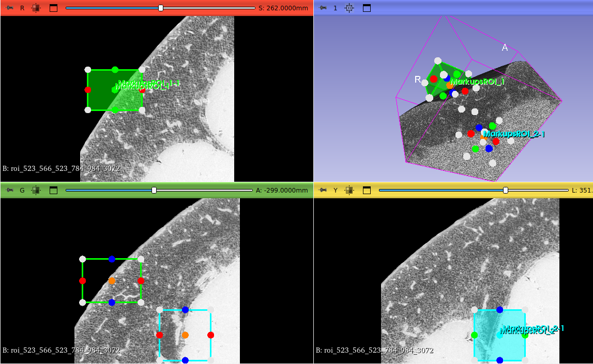

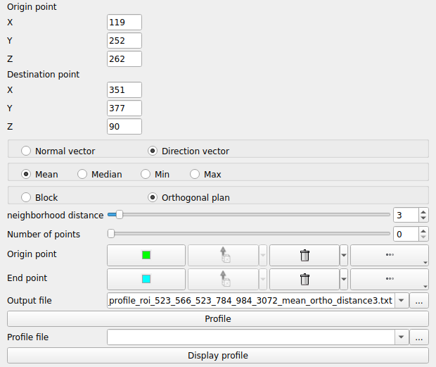

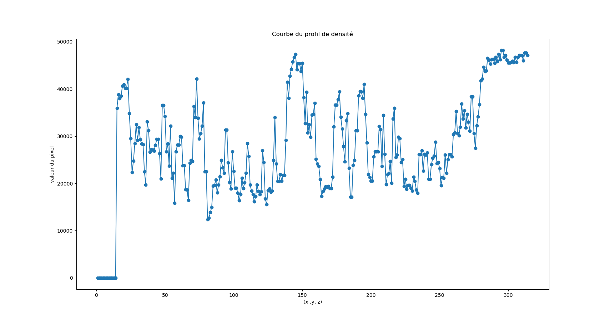

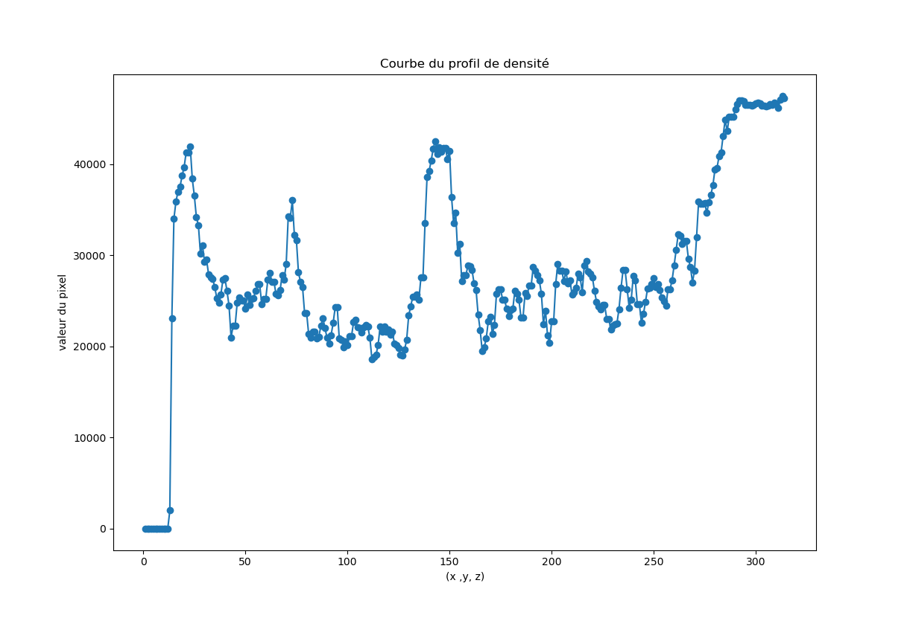

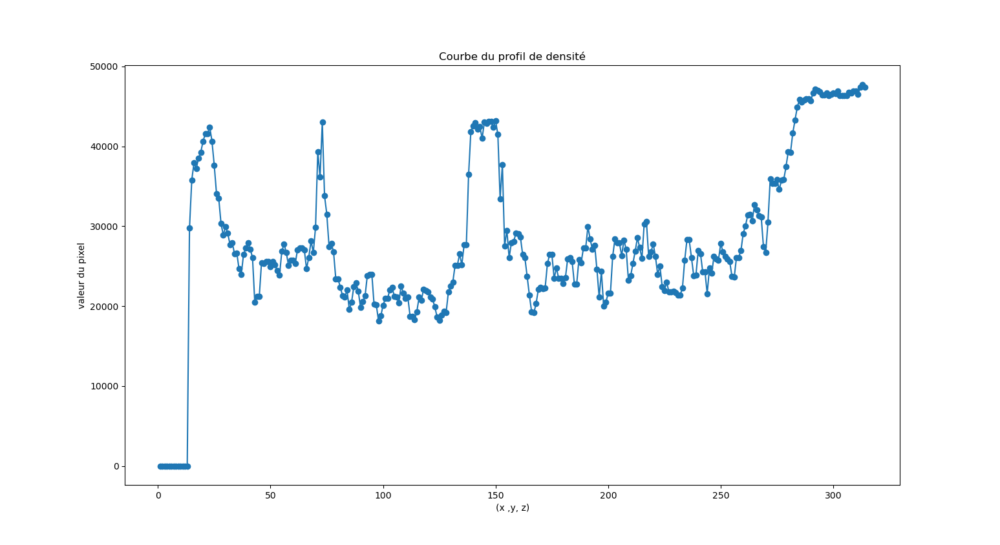

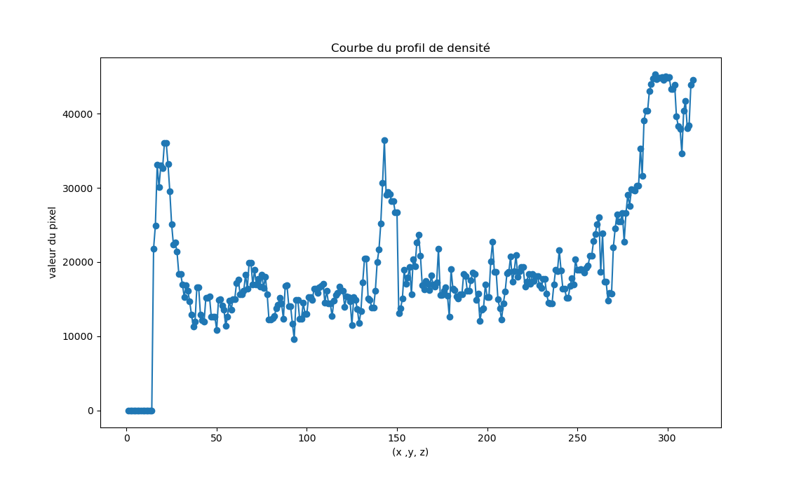

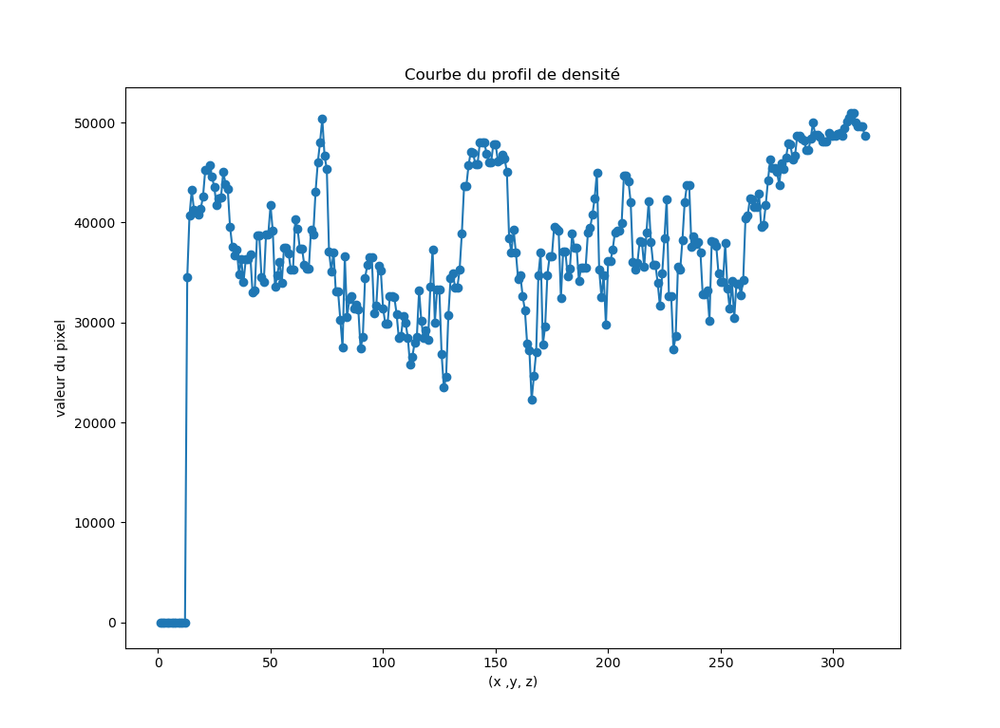

