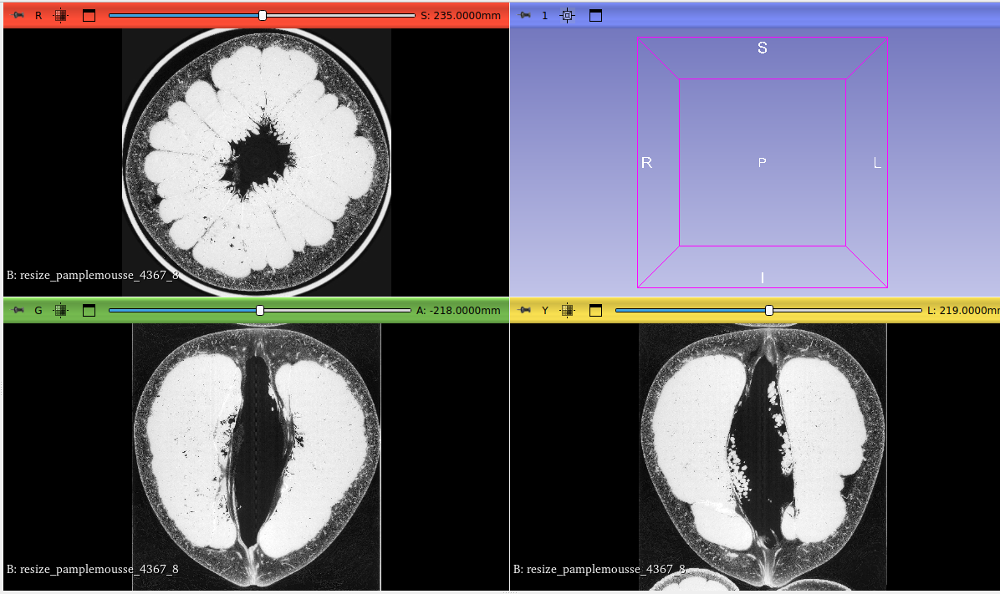
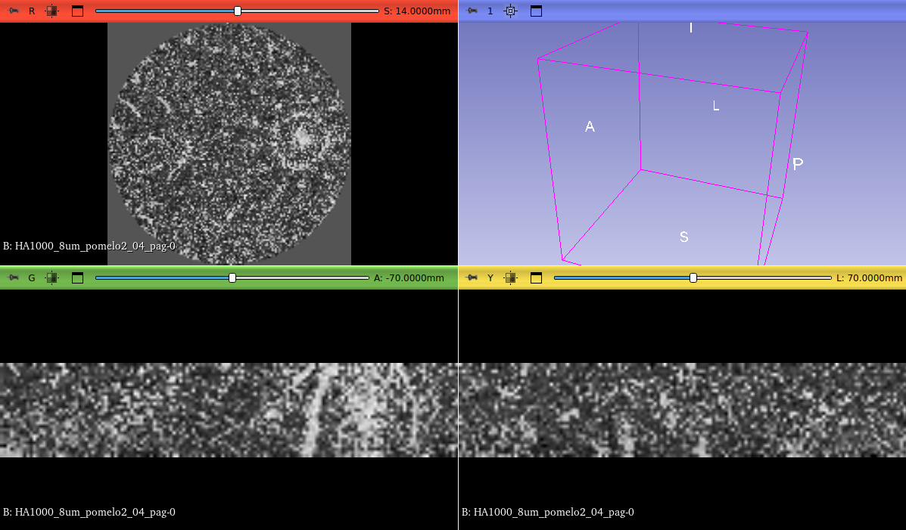

# extension3DSlicer

[](https://doi.org/10.5281/zenodo.13871319)

This extension of 3D Slicer was created as part of my M2 internship in Computer Science for Image and Sound at LaBRI and I2M from april 2024 to september 2024.

## Name
Visualization and analysis of the structure of a natural material

## Developer
RIVERAIN Olivier

## Description
Master 2 Internship in Computer Science for Image and Sound supervised by Fabien Baldacci (LaBRI), Louise Le Barbenchon (I2M) and Anne Vialard (LaBRI).

Development of a 3D Slicer extension in python and C++. Implementation of parallelization on all computer cores to accelerate the speed of decompression and loading of large images acquired within the Grenoble synchrotron. Conversion of 2D slices into 3D images. Creation of regions of interest by the user. Navigation in several acquisition resolutions. Creation and display of a density profile with calculation of the mean, median, minimum, maximum by taking into account a neighborhood in the form of a block or an orthogonal plane.

## Installing 3D Slicer

https://slicer.readthedocs.io/en/latest/user_guide/getting_started.html#installing-3d-slicer

### Installing under linux

```sh
sudo apt install libglu1-mesa libpulse-mainloop-glib0 libnss3
```

download and open the tar.gz archive and copy directory to the location of your choice

run the Slicer executable


### Installing under macOS

```sh
brew install --cask slicer
```

### Installing under windows

download and run the installer

run slicer from the Windows start menu

## Installing dependances for the extension

### Installing under linux

```sh
sudo apt install cmake libinsighttoolkit5-dev libmagick++-6.q16-dev python3-numpy python3-matplotlib
```

### Installing under macOS

```sh
xcode-select --install
brew install cmake
brew install itk
brew install imagemagick
pip3 install numpy matplotlib
```

### Installing under windows

**Installing python and pip** from https://www.python.org/downloads/windows/

```sh
pip install numpy matplotlib
```

<!--
installing mingw-w64 from https://www.mingw-w64.org/ for example winlibs 14.2.0 release 2 without t LLVM/Clang/LLD/LLDB

extract in C:\ it creates the directory mingw64

add  C:\mingw64\bin to the path in the environment variables


open powershell and type g++ --version and you can see

 

installing itk from https://docs.itk.org/en/latest/download.html 

extract in C:\ it creates the directory InsightToolkit-5.3.0

-->

**Installing cmake** from https://cmake.org/download/

**Installing ImageMagick** from https://imagemagick.org/script/download.php

During installation check the following cases

 


**Installing ITK**

Download itk from https://docs.itk.org/en/latest/download.html 

Extract in C:\ it creates the directory InsightToolkit-5.3.0

There is no installer for ITK. So it has to be compiled manually. The documentation says to use the cl.exe compiler provided by Visual Studio.

Installing visual studio community from https://visualstudio.microsoft.com/fr/downloads/ with Desktop development C++ workload, https://learn.microsoft.com/fr-fr/cpp/build/vscpp-step-0-installation?view=msvc-170

Compiling ITK

```sh
cd InsightToolkit-5.3.0
mkdir build
```
<!-- cmake -G "MinGW Makefiles" ..
mingw32-make -->

Run CMake gui.

Select the folder containing the ITK sources using Browse Source, here C:/InsightToolkit-5.3.0.

Select the build folder using Browse Build, here C:\InsightToolkit-5.3.0/build.

Click the Configure button.


Choose Visual Studio 17 2022.

Click the Finish button.


After a few minutes, you see this.


Click the Generate button and you see this.


Click the Open Project button.

In Visual Studio, go to the Generate menu -> Build -> 0 ALL_Build to compile the ITK library.


The ITK library is compiled.


todo (voir s'il faut ajouter le chemin vers build dans variable environnement PATH)

**Create an environment variable HOME** with the value C:\citrusSkin.  Don't forget to create the citrusSkin folder first.

## Compile programs in C++

### Under Linux and macOS

```sh
cd programs

mkdir build

cd build

cmake ..

make

cp ../displayProfile.py .

cp ../applyMask.py .

```

### Under Windows
todo

```sh
cd programs

mkdir build

cd build


```

## Installing extension in 3D Slicer


[Tutorial to install this extension in 3D Slicer] (https://youtu.be/jbea2kZqlYo)

For now this extension has been tested for Linux. For macOS, I don't have an Apple computer, I'm waiting for feedback from users. For Windows, the extension needs to be modified to take into account the specificities of Windows.

## Tutorials

### Bind C++ programs with the extension


Click on the three small dots and select the folder containing the C++ executable files.


### Create a 3D file


- click on the three little dots and select the input directory containing all the slices

- choose the interval of the slices using the two cursors

- choose the reduction factor using the cursor, the value applies to each of the three dimensions of the file

- click on the three little dots to define a file name for the 3D file that will be built, for example path/filename.nrrd where nrrd is the desired format

- Output Info displays the dimensions and size of the future 3D file

- finally click on the Create 3D resized file button to create the 3D file

### Display a 3D file


- click on the three little dots to select a 3D file

- click on the Add file button to display the 3D file

For example, you can see this.



### Create an area of interest


- first you must display a 3D file and select the input directory containing the slicers

- activate the creation of the area of ​​interest by clicking on the second button from the left on the line of buttons

- holding down the left mouse button and with the help of the mouse create the area of ​​interest, then release the left mouse button

- by clicking on the central point of the area and holding down the left mouse button, you can move the area, the values ​​of X, Y and Z correspond to the coordinates of the center

- by clicking on one of the points delimiting the area you can change the size of the area, size X, size Y and size Z display the size in pixels of the area

- the square radio button allows you to set size X and size Y to the same value, cube allows you to set size X, size Y and size Z to the same value to obtain a cube-shaped area of ​​interest

- click on the three little dots to define an output file name for the 3D file that will be built, for example path/filename.nrrd where nrrd is the desired format

- finally, click on Create ROI to create the 3D file corresponding to the constructed area of ​​interest


For example, if you display the 3D file, you can obtain this.


### Navigate through the different acquisition resolutions


If you want to display the areas you must first create a json file in the directory containing all the images. This file must be named nameofthedirectory.json and contain information about the different resolutions, see the example images. Be careful, if you copy the image folder to another computer you must modify the path in the json file.


When you click on the Display Zoom Area box, you can see the list of available 8um areas and their display in the different views.


When you click on one of the items in the list, the display focuses on this area.


If you click on the Zoom button, a temporary 3D file of the area is created and displayed in the views.



You can also do the same for a 2um area.


### Compute and display a density profile

First, you need to display a 3D file as in **Display a 3D file**, either by having created it as in **Create a 3D file**, or by having created an area of ​​interest as in **Create an area of interest**.


- Origin point: activate the creation of this point by clicking on the second button from the left on the line of buttons,  holding down the left mouse button and with the help of the mouse create the area for the origin point, then release the left mouse button. You can move this point by clicking on the center of the area and moving the mouse. X, Y and Z display the coordinates.

- End Point: same as for origin point.

- you can choose between a normal vector or a direction vector. For now, the calculation of a normal vector has not been implemented yet.

- you can select a calculation based on the mean, median, minimum and maximum for the neighborhood area

- block means that the neighborhood takes the form of a cube (3D), orthogonal plane determines a 2D plane perpendicular to a point


- the value of the neighborhood distance is determined by the slider

- the number of points to calculate in the profile is determined by the cursor. If we set this value to 0 then the maximum number of possible points is taken into account

- click on the three little dots to define an output file name to save the coordinates and levels of density, you can choose a file with extension .txt

- finally, click on Profile. The profile will be displayed just under the Display profile button.

- you can load a profile file by clicking on the three little dots of Profile file and click on the Display profile button

- you can save the profile image by clicking on Save Profile

Here are some examples of profiles.


